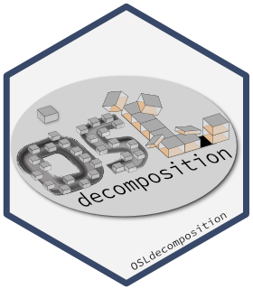

<!-- README.md was auto-generated by README.Rmd. Please DO NOT edit by hand!-->

# OSLdecomposition 

Identify and Separate Continuous-Wave Optically Stimulated Luminescence
(CW-OSL) Signal Components

