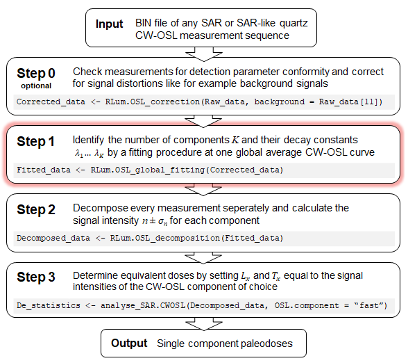

```{r step1_setup, include=FALSE}

 #   mathjax: local
  #  self_contained: false

Last_changed <- "2020-11-16"

library(kableExtra)
library(knitr)
library(ggplot2)
library(gridExtra)
library(scales)

plot_theme <- theme_classic()
image_file <- NULL

knitr::opts_chunk$set(fig.width=7,
                      fig.asp=.6,
                      results = "asis",
                      warning=FALSE,
                      message=FALSE,
                      error=FALSE,
                      echo=FALSE,
                      cache=FALSE)

# Find out the overall number of 'record_type' curves
# ToDo: Get this info (and the global_average data) directly from sum_OSLcurves outout
record_type <- fit_data$parameters$record_type
n.curves <- 0
for (j in 1:length(data_set)) {
  n.curves <- n.curves + sum(names(data_set[[j]]) == record_type)}
```

`r record_type` signal component identification report for data set **`r object_name`** analysed by function `RLum.OSL_global_fitting()` at `r Sys.time()`; *R* package [**OSLdecomposition**](http://luminescence.de/) version  `r packageVersion("OSLdecomposition")` by [Mittelstraß *et al.* (2019)](#disclaimer)

***


<font color="black">

## Results 

[Step 1](#basics) of a component-resolved dose calculation is the identification of the components occurring in the data set. 
Constant signal component decay rates $\lambda$ over all measurements were assumed and one global average CW-OSL curve was calculated. On this, a series of multi-exponential decay model fittings with an increasing number of components $K$ was performed. The resulting CW-OSL models can be compared by their photoionisation cross sections $\sigma$ and their fitting quality to select the best suiting set of signal components. See section [Methods](#Overview) for details.

### OSL plots {.tabset .tabset-pills}

#### Global average
```{r step1_draw_global_curve, fig.width=7, fig.asp=.4}

if (!is.null(image_format)) image_file <- paste0(image_path, "step1_fig1_global_average.", image_format)

sum_OSLcurves(data_set,
              record_type = record_type,
              output.plot = TRUE,
              theme.set = plot_theme,
              plot.first = FALSE,
              title = NULL,
              verbose = FALSE,
              filename = image_file)

cat(paste0("<br><i><b>Figure 1.1:</b> <u>Red line</u>: Global average curve built from the arithmetic mean of all curves. <br><u>Grey points</u>: Data points of all measurements.</i><br><br>"))
```


```{r step1_draw_fittings}

# Define dynamic Rmarkdown code
dynamic_code <- c(
    "#### K = {{i}}\n",
    "```{r tab_{{i}}}\n",
    "if (!is.null(image_format)) image_file <- paste0(image_path, \"step1_fig1_K={{i}}_fitting.\", image_format)\n",
    "plot_OSLcurve(fit_data$curve, 
                fit_data$component.tables[[{{i}}]], 
                title = NULL,
                show.legend = TRUE,
                show.crosssec = TRUE,
                show.initial = FALSE,
                theme.set = plot_theme,
                filename = image_file)\n",
    "cat(paste0(\"<br><i><b>Figure 1.{{i+1}}:</b> Fit model with K = {{i}} signal components<br>\", \"<u>Upper left</u>: CW-OSL plot of global average curve and fitting model.<br>\", \"<u>Upper right</u>: pseudoLM-OSL transformed plot<br>\",\"<u>Lower left</u>: Residual curve between fitting and global average curve<br>\",\"<u>Lower right</u>: Estimated type of quartz OSL component (colored), photoionisation cross sections $\\\\sigma$, decay rates $\\\\lambda$ and signal intensity $n$.</i><br><br>\"))",
    "```\n"
  )

tabs <- lapply(as.list(1:nrow(fit_data$F.test)),
                function(i) knitr::knit_expand(text = dynamic_code))


# Now knit the dynamic code. This has to be in a seperate chunk
```

`r knitr::knit(text = unlist(tabs))`


### Photoionisation cross sections

Under the assumption that the provided optical stimulation parameters ($\lambda_{stim}=$ `r fit_data$parameters$stimulation.wavelength` $\mathrm{nm}, \Phi_{stim}=$ `r fit_data$parameters$stimulation.intensity` $\mathrm{\frac{mW}{cm^2}}$) were correct, the found decay rates were translated into [photoionisation cross section values](#M3) and set into relation with quartz OSL literature values:

```{r step1_draw_crosssections_diagram, fig.width=10, fig.asp=0.32}

#cross.plot.height <- 0
#if ((stimulation_wavelength >= 465) && (stimulation_wavelength <= 480)) cross.plot.height <- 3
#cross.plot.height <- (cross.plot.height + 2 + K.selected) * 0.01
#knitr::opts_current$set(fig.asp = cross.plot.height)

if (!is.null(image_format)) image_file <- paste0(image_path, "step1_fig2_cross-sections.", image_format)

plot_PhotoCrosssections(fit_data,
                        stimulation.intensity = fit_data$parameters$stimulation.intensity,
                        stimulation.wavelength = fit_data$parameters$stimulation.wavelength,
                        filename = image_file)

# <font color=\"black\"> </font>

  cat("<br><i><b>Figure 2:</b> Photoionisation cross section comparison assuming a stimulation light intensity of", fit_data$parameters$stimulation.intensity, "mW/cm² and a stimulation light wavelength of", fit_data$parameters$stimulation.wavelength,"nm.</i><br><br>")
```

Systematic shifts in the photoionisation cross sections are likely when compared to literature values. These are caused by false estimates of the effective stimulation intensity. To manually correct for these shifts, apply the following rules when setting `RLum.OSL_global_fitting(stimulation_intensity = ?)`:

* <b>Increase</b> stimulation intensity to shift the cross sections towards <b>right</b>
* <b>Decrease</b> stimulation intensity to shift the cross sections towards <b>left</b>

### Component number selection

Selecting those fitting model with the physically correct number of components $K$ is not trivial. According to [Bailey et al. (1997)](#ref), [Mittelstraß (2019)](#ref) and others, are most quartz samples  sufficiently described by three CW-OSL components. Thus, the $K = 3$ fitting is chosen as default model. However, additional OSL components might give a significant signal contribution and might make the $K = 3$ model insufficient. Or in a measurement are just two components apparent. Therefore, an $F$-test is performed like suggested by [Bluszcz & Adamiec (2006)](#ref). The test criterion $F_K$ measures the improvement in the fitting quality by an additional component, see section [F-test](#M4) for details. Falls $F_K$ below the preset value of *F*~threshold~ =  `r fit_data$parameters$F.threshold`, the model with $(K-1)$-components is selected as best model. 


```{r step1_fitting_table}

F_table <- fit_data$F.test.print
row_index <- c(1:nrow(F_table))
F_table <- cbind(data.frame(K = row_index), F_table)

# if (fit_data$parameters$background.fitting == TRUE) {
# colnames(F_table) <- c("  $K$  ", paste0("$\\lambda_", row_index,"$ $(s^{-1})$"), "background", "RSS", "$F_K$")

# Default model with K = 3
K.default <- 3
K.default.text <- "<u>Green stripe</u>: Default CW-OSL model for quartz."
if (fit_data$K.selected < 4) {
  
  K.default <- fit_data$K.selected
  K.default.text <- ""}

colnames(F_table) <- c("  $K$  ", paste0("$\\lambda_", row_index,"$ $(s^{-1})$"), "$RSS$","$F_K$")

# Table caption:
cat(paste0("<br><i><b>Table 2:</b> Decay rates and fitting quality parameters in dependence of component number $K$. <br>$RSS$: Residual square sum. $F_K$:  Measure of fitting improvement.</i><br>", K.default.text, " <u>Blue stripe</u>: F-test selected model.<br>"))

# print F-test table
kable(F_table, escape = TRUE, align = "c") %>% 
  kable_styling(bootstrap_options = c("condensed")) %>%  # "striped", 
  row_spec(K.default, background = "lightgreen") %>%
  row_spec(fit_data$K.selected, background = "lightblue")
```

```{r eval=FALSE, include=FALSE}

### Signal bin overdispersion idea

# List of model selection helps:
# 1. Comparision of the photoionisation cross section with literature values
# 2. Evaluation of the fitting quality by an F-test and the *reduced Chi²*
# 3. (ToDo:) Evaluation of the decomposition quality by signal bin overdispersion

# The idea is the following: Incorrect decay rates lead to lopsided residual curves over the signal bin intervals in the decomposition process. These lopsided residuals can be detected by taking the signal bin variance in relation to the poisson distribution variance. The result is a kind of "overdispersion" value for each signal bin in each OSL record. The K = ? model where the median of these overdispersions is minimal, should be the best suiting model for the majority of CW-OSL curves

```

<br><br><br><br>


## Methods 

```{r eval=FALSE, include=FALSE}
<i><u>Further content planned for this chapter:</u>

* picture with shematic overview
* deeper explanation of multi-exponential fitting
* Some sentences about the limitations and the behaviour of the F-test
* Explanation why global background-fitting is counter-productive

</i><br>
```


### Basics {#basics}

The data analysis approach assumes that all CW-OSL signal curves in a data set can be sufficently described by a sum of exponential decays with first order kinetics:

$$I(t) = \sum_{i=1}^K n_ie^{-\lambda_it}$$

Here, $I(t)$ is the CW-OSL signal, $K$ is the number of signal components. Each component is defined by its intensity $n$ and its decay rate $\lambda$.  

To achieve component-seperated dose information, the data analysis process is divided into multiple steps:

<center>



</center>

### Step 1 workflow {#Overview}

This report covers the Step 1 analysis, which can be outlined as following:

<center>


</center>

Detailed explanations on step 1.1 and step 1.2 can be found in [Mittelstraß (2019)](#ref). Practical advice can be found in the *R* documentations `?sum_OSLcurves` and `?fit_OSLcurve`.

Step 1.2 is based on the ideas of [Bluszcz & Adamiec (2006)](#ref). The differential evolution (see [Price et al. 2006](#ref)) was performed by the function `DEoptim` from the package `DEoptim` [(Ardia et al. 2020)](#ref) and deployed `decompose_OSLcurve` (see Step2) for the calculation of the linear parameters. The Levenberg-Marquardt fitting was performed by the function `nlsLM` from the package `minpack.lm` [(Elzhov et al. 2016)](#ref).


### Photoionisation cross sections {#M3}

The signal decay rate $\lambda_{k}$ of each component is translated into the photoionisation cross section $\sigma_{k}$ of the associated defect state by: 

$$\sigma_{k}=\lambda_{k} {hc \over \Phi_{stim}\lambda_{stim}}$$
Here, $h$ is the Planck constant, $c$ is the speed of light, $\Phi_{stim}$ is the stimulation light intensity and $\lambda_{stim}$ is the stimulation light wavelength. If this wavelength is about ~ 470 nm and the measured sample material is quartz, then the resulting photoionisation cross sections can be compared with literature values, see figure 2. For the automatic assignement of component names, an approximated 2-$\sigma$ bandwidth of the average literature value was used, see `?fit_OSLcurve` the exact definition.

**Important note:** The stimulation light intensity, displayed by OSL/TL reader control software, might differ from the effective stimulation light intensity. Degrading of stimulation LED, /lasers and filters as well as a dirty chamber window can significantly decrease the light output. In addition, the light flux in the bulk material depends on the reflectance and transmittance of the sample, its fixation and the sample carrier. Systematic shifts in the photoionisation cross section values are therefore likely.


### F-test {#M4}

[Bluszcz & Adamiec (2006)](#ref) proposed the use of an *F*-test to compare CW-OSL models by their fitting quality. The test criterion $F_K$ measures the improvement caused by an additional component. It compares the residual square sum (*RSS*) of the $K-1$ model with the new $K$ model:

$$F_K = \frac{(RSS_{K-1} - RSS_K)/2}{RSS_K(N - 2K)} $$

Here, $N$ is the number data points (channels) of the global average curve and $K$ is the number of OSL components in the fitting model. If $F_K$ falls below a preset threshold value (Here, $F_{threshold}$ = `r fit_data$parameters$F.threshold`), the new fitting model with one additional component is apparently not significantly better than the *K* - 1 model.

However, components with not-first-order kinetics, variations in the decay rates and too long measurement duration can lead to the detection of imaginary signal components, as [Mittelstraß (2019)](#ref) discussed in more detail. Therefore, the F-test outcome should be taken with care. Regarding the parameter of $F_{threshold}$, is the ideal value data set dependent. [Mittelstraß (2019)](#ref) showed that reasonable settings are in the range of: $50 < F_{threshold} < 300$


## General remarks {#disclaimer}

This report was automatically generated by functions of the **R** package `OSLdecomposition` written and maintained by Dirk Mittelstraß (<dirk.mittelstrass@luminescence.de>). This package is preferably used together with the **R** package `Luminescence` ([link](https://cran.r-project.org/package=Luminescence)) by [Kreutzer *et al.* (2012)](#ref). For the dynamic creation of this HTML report, the **R** packages `knitr` and `rmarkdown` are used, see [Xie (2015)](#ref) and [Xie *et al.* (2018)](#ref). All diagrams are drawn with `ggplot2` [(Wickham 2016)](#ref).

The data analysis method covered with this report was developed for CW-OSL SAR protocol measured quartz samples, see [Murray and Wintle (2000)](#ref). It might be also useful for the analysis of Al2O3 or feldspar samples measured with SAR-like protocols. You can use, share and publish this report and the containing results at will. But we demand to refer to the **R** package `OSLdecomposition` including its version number (`r packageVersion("OSLdecomposition")`) if you publish the results in a peer-reviewed journal. Please include the following reference to your publication:

-------------------

Mittelstraß, D., 2019. Decomposition of weak optically stimulated luminescence signals and its application in retrospective dosimetry at quartz, Master thesis, TU Dresden, Dresden. <br> https://iktp.tu-dresden.de/IKTP/pub/19/Dirk_Mittelstrass_Master.pdf  <br>
*(reference will be replaced as soon as peer-reviewed publication is accepted)*

-------------------

We allow and encourage you to add the HTML file of this report to the electronical supplement of your publication.  


## References {#ref}

Ardia, D., Mullen, K.M., Peterson, B.G., Ulrich, J., 2020. DEoptim: Differential Evolution in R.<br>
https://CRAN.R-project.org/package=DEoptim

Bailey, R. M., Smith, B. W. and Rhodes, E. J., 1997. Partial bleaching and the decay form characteristics of quartz OSL, Radiation Measurements, 27(2), 123–136.<br>
https://doi.org/10.1016/S1350-4487(96)00157-6

Bluszcz, A., Adamiec, G., 2006. Application of differential evolution to fitting OSL decay curves. Radiation Measurements 41, 886–891.<br>
https://doi.org/10.1016/j.radmeas.2006.05.016

Durcan, J.A., Duller, G.A.T., 2011. The fast ratio: A rapid measure for testing the dominance of the fast component in the initial OSL signal from quartz. Radiation Measurements 46, 1065–1072.<br>
https://doi.org/10.1016/j.radmeas.2011.07.016

Elzhov, T.V., Mullen, K.M., Spiess, A.-N., Bolker, B., 2016. minpack.lm: R Interface to the Levenberg-Marquardt Nonlinear Least-Squares Algorithm Found in MINPACK, Plus Support for Bounds.<br>
https://CRAN.R-project.org/package=minpack.lm

Jain, M., Murray, A.S., Bøtter-Jensen, L., 2003. Characterisation of blue-light stimulated luminescence components in different quartz samples: implications for dose measurement. Radiation Measurements 37, 441–449.<br>
https://doi.org/10.1016/S1350-4487(03)00052-0

Kreutzer, S., Schmidt, C., Fuchs, M.C., Dietze, M., Fuchs, M., 2012. Introducing an R package for luminescence dating analysis. Ancient TL 30.<br>
http://ancienttl.org/ATL_30-1_2012/ATL_30-1_Kreutzer_p1-8.pdf

Mittelstraß D., Schmidt C., Beyer J., and Straessner A., 2019. Automated identification and separation of quartz CW-OSL signal components with R. talk presented at the Central European Conference on Luminescence and Trapped-Charge dating: DLED 2019, Bingen, Germany<br>
http://luminescence.de/OSLdecomp_talk.pdf

Murray, A. S. and Wintle, A. G., 2000. Luminescence dating of quartz using an improved single-aliquot regenerative-dose protocol. Radiation Measurements 32 <br>
https://doi.org/10.1016/S1350-4487(99)00253-X

Price, K.V., Storn, R.M., Lampinen, J.A., 2006. Differential Evolution - A Practical Approach to Global Optimization, Natural Computing. Springer-Verlag.

Singarayer, J.S., Bailey, R.M., 2003. Further investigations of the quartz optically stimulated luminescence components using linear modulation. Radiation Measurements, Proceedings of the 10th international Conference on Luminescence and Electron-Spin Resonance Dating (LED 2002) 37, 451–458.<br>
https://doi.org/10.1016/S1350-4487(03)00062-3

Wickham, H., 2016. ggplot2: elegant graphics for data analysis, Second edition. ed, Use R! Springer, Cham.<br>
https://ggplot2.tidyverse.org/

Xie, Y., 2015. Dynamic documents with R and Knitr, Second edition. ed. CRC Press/Taylor & Francis, Boca Raton.<br>
https://yihui.org/knitr/

Xie, Y., Allaire, J.J., Grolemund, G., 2018. R Markdown: the definitive guide. Taylor & Francis, CRC Press, Boca Raton.<br>
https://bookdown.org/yihui/rmarkdown/


## Script parameters

```{r step1_build_parameter_table}

# Algorithm settings
para_table <- data.frame(n = "Analyzed data set", t = object_name)
para_table <- rbind(para_table, 
                    data.frame(n = "Analyzed record type", t = record_type),
                    data.frame(n = "Maximum allowed components ", t = paste0("*K*~max~ = ", fit_data$parameters$K.max)),
                    data.frame(n = "Threshold *F*-value", t = paste0("*F*~threshold~ = ", fit_data$parameters$F.threshold)))

# Photo-ionisation
para_table <- rbind(para_table, 
                    data.frame(n = "Stimulation wavelength", t = paste0(fit_data$parameters$stimulation.wavelength," nm")),
                    data.frame(n = "Stimulation intensity", t = paste0(fit_data$parameters$stimulation.intensity," mW/cm²")))

#  Global curve
ch.N <- length(fit_data$curve$time)
ch.W <- fit_data$curve$time[2]-fit_data$curve$time[1]
para_table <- rbind(para_table, 
                    data.frame(n = "No. of input measurements", t = format(n.curves)),
                    data.frame(n = "No. of input sequences", t = format(length(data_set))),
                    data.frame(n = "Channel time ", t = paste0("$\\delta$*t* = ", prettyNum(ch.W), " s")),
                    data.frame(n = "Channels ", t = paste0("*N* = ", ch.N)),
                    data.frame(n = "Global curve length ", t = paste0("*t* = *N*$\\delta$*t* = ", prettyNum(ch.W*ch.N), " s")))


colnames(para_table) <- c("","")
kable(para_table, escape = TRUE, align = "l",) %>%
  kable_styling(bootstrap_options = c("condensed"), full_width = FALSE, position = "left") %>%
  pack_rows("Settings", 1, 4) %>%
  pack_rows("Photoionisation cross section parameter", 5, 6) %>%
  pack_rows("Global curve properties", 7, 11)

```
<br><br>
Last major change in the script code: `r Last_changed`  by D. Mittelstraß
<br></font>

**Session info:**

```{r session_info}
print(sessionInfo(), locale = FALSE)
```


```{r step1_show_component_table, eval=FALSE, include=FALSE}

cat(paste0("<br><i><b>Table 1:</b> Signal components of the K = ", fit_data$K.selected," multi-exponential decay model chosen as best suiting fitting by an F-test. Each signal component is defined by its intensity $n$ and its decay contant $\\lambda$, which can be converted in the photoionisation cross section $\\sigma$.<br><u>First channel share</u>: Average contribution to the signal at beginning of the measurement.<br><u>Bleaching grade</u>: Average approximated defect state depletion during the stimulation.</i><br>"))

component_table <- fit_data$components

component_table$lambda <- round(component_table$lambda, digits = 4)
component_table$initial.signal <- paste0(round(component_table$initial.signal * 100, digits = 1), "%")
component_table$bleaching.grade <- paste0(round(component_table$bleaching.grade * 100, digits = 1), "%")
colnames(component_table) <- c(" ", "$\\lambda$ $(s^{-1})$", "$n$ (counts)", "$\\sigma$ (cm²)", "first channel share", "bleaching grade")

#kable(component_table, escape = TRUE, align = "c",) %>%
#  kable_styling(bootstrap_options = c("striped", "condensed"))
kable(component_table, escape = TRUE, align = "c",) %>%
  kable_styling(bootstrap_options = c("striped", "condensed")) %>%
  column_spec(1, bold = TRUE)

```

```{r step1_draw_best_suiting_fit, eval=FALSE, include=FALSE}
cat(paste0(image_path, "figure_1_1_best_fit.", image_format),"\n")

plot_OSLcurve(fit_data$curve, 
              fit_data$components, 
              title = NULL,
              filename = paste0(image_path, "figure_1_1_best_fit.", image_format))

cat(paste0("<br><i><b>Figure 1:</b> Fit model with K =", fit_data$K.selected," (black), global average curve (grey) and signal components (colored)<br>", "<u>Upper left</u>: Linear diagram. <u>Upper right</u>: pseudoLM-OSL diagram<br>",
    "<u>Lower left</u>: Residual curve between fit and global average curve<br>",
    "<u>Lower right</u>: Fitting result table with estimated type of component names</i><br><br>"))
```


