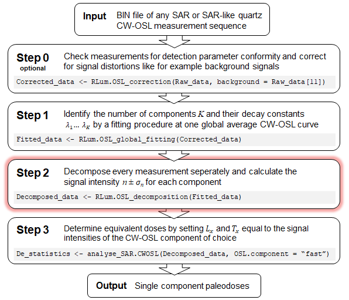

Report of the [Mittelstraß *et al.* (2019)](#disclaimer) Step 2 analysis of the data set **`r object_name`** performed with the function `RLum.OSL_decomposition()` from the **R** package `OSLdecomposition`  `r packageVersion("OSLdecomposition")` executed at `r Sys.time()`.

***

```{r step2_setup, include=FALSE}

Last_changed <-"2020-09-03" 

# ToDo's:
# * Bug: The barplots sort the columns alphabetically


### Planned further features:
#
# * Change tab headers #{{j}} to record$sequence based nummeration
# * alternative bar-plot arrangement with all natural dose measurements in one plot etc.
# * Add kableExtra::add_header_above() with component names in table 1
# * barplot with initial signal compositions
# * Scatterplots or full correlogram of the components and the irradiation time
#     Hint: search for "Correlogram"
#     or: http://www.sthda.com/english/wiki/correlation-analyses-in-r
#     simple example:
#     pairs(subset(results, select = c("n.1", "n.2", "n.3", "IRR_TIME")))

library(numOSL)
library(knitr)
library(ggplot2)
library(gridExtra)
library(kableExtra)
library(scales)

knitr::opts_chunk$set(fig.width=7,
                      fig.asp=.6,
                      results = "asis",
                      warning=FALSE,
                      message=FALSE,
                      error=FALSE,
                      echo=FALSE,
                      cache=FALSE)
## set ggplot design 
# (just for directly plotted diagrams. sub-function plot are not affected)
theme_set(theme_minimal())
graph_colors <- c("red3","green3","royalblue3","darkorchid","gold","brown","pink")

# Not every list element in the data set may contain the selected record_type
# so we have to collect the data indices in a seperate list
record <- list()
n.curves <- 0

for (j in 1:length(data_set)) {

  index <- c(NULL)
  
  for (i in 1:length(data_set[[j]]@records)) {
    if (data_set[[j]]@records[[i]]@recordType == record_type) {
      
      index <- c(index, i)
      n.curves <- n.curves + 1}}
  
  if (length(index) > 0) {
    
    record[[""]] <- list(sequence = j, 
                         index = index)}}

# assign some local objects just for better readable code:
K <- nrow(dec_data$decompositon.input)
record_type <- dec_data$parameters$record_type
background_fitting <- dec_data$parameters$background_fitting
input_table <- dec_data$decompositon.input
```


## Basics
<font color="black">

We assume that all CW-OSL signal curves in this data set can be sufficently described by a sum of exponential decays with first order kinetics:

$$I(t) = \sum_{i=1}^K n_ie^{-\lambda_it}$$
Here, $I(t)$ is the CW-OSL signal, $K$ is the number of signal components. Each component is defined by its intensity $n$ and its decay rate $\lambda$.  

To get component-seperated dose information, we divide the data analysis process into multiple steps:

<center>



</center>

This report displays the results of Step 2, performed by `OSLdecomposition::RLum.OSL_decomposition()`. In  Step 1 we determined the number of components $K$ and their decay rates $\lambda_1, ..., \lambda_K$:

```{r step2_decay_rate_list}
cat(paste0("* $K=", K,"$\n"))
for (k in 1:K) {
  cat(paste0("* $\\lambda_", k,"=", round(input_table$lambda[k], digits = 4),
             "$ $s^{-1}$ (", input_table$name[k],")\n"))}
```

We assume that the decay rates $\lambda$ are similar for all measurements and set them as global constants. Thus, each CW-OSL decay curve can be described by:

```{r step2_draw_formula}
append_B <- ""
if (background_fitting) append_B <- "+B"

# Draw basic formula
cat("$$I(t) = ", paste(paste0("n_",1:K, "e^{-",round(input_table$lambda, digits = 4),"t}"), collapse = "+"), append_B, "$$")
```


To calculate `r paste0("$",paste(paste0("n_",1:K), collapse =","),"$")` for all CW-OSL measurements, we divide each signal curve into *K* = `r K` [signal bins](#bins), build an equation system and [solve this analytical](#decomposition).


## Results

The processed data set consists of `r length(data_set)` `RLum.Analysis` objects. Each `RLum.Analysis` object represents one measurement sequence and therefore one aliquot, or one grain in case of single grain data.

```{r step2_create_tab_data} 
### This chunk rearranges the data for the dynamic tabs, no direct output is produced

intensity_tables <- list()
barplots <- list()
barplot_labels <- list()

for (j in 1:length(record)) {
  
  result <- dec_data$results[dec_data$results$list.index == record[[j]]$sequence,]

  if(result$IRR_TIME[1] == 0) result$IRR_TIME[1] <- "?"
  
  aliquot_table <- subset(result, select = c(record.index, IRR_TIME))
  
  plot_table <- data.frame(NULL)

  colnames(aliquot_table) <- c("record index", "irradiation time (s)")
  
  for (k in 1:K) {
    
    intensities <- result[,colnames(result) == paste0("n.", k)]
    #intensities_reduced <- intensities - result[,colnames(result) == paste0("n.residual.", k)]
    sigmas <- result[,colnames(result) == paste0("n.error.", k)]
    
    # Append current component to Table 1 table
    new_col <- data.frame(row = paste0(round(intensities), " ± ", round(sigmas)))
    colnames(new_col) <- paste0("$n_", k, " ± \\sigma_", k, "$ (", input_table$name[k] ,")")
    aliquot_table <- cbind(aliquot_table, new_col)
    
    # Include component only in the bar-plot if it is bleached to at least 50 %
    bleaching_grade <- 1 - sum(result[,colnames(result) == paste0("n.residual.", k)], na.rm = TRUE) / 
                           sum(intensities, na.rm = TRUE)
    if (bleaching_grade > 0.5) {
         # Append current component to Figure 2 plot data
      plot_table <- rbind(plot_table, data.frame(x_axis = 1:length(intensities),
                                               y_axis = intensities,
                                               component = input_table$name[k]))}}
  
  intensity_tables[[j]] <- aliquot_table
  barplots[[j]] <- plot_table
  barplot_labels[[j]] <- data.frame(breaks = 1:length(intensities),
                                    labels = paste0("#", 1:length(intensities), 
                                                    "\n", result$IRR_TIME, " s"))
  # add record@info[["IRR_UNIT"]]
}
```

### Intensitiy tables {.tabset .tabset-pills}

The decompositon process calculates the signal component intensities $n$ and their standard deviations $\sigma$. The intensity values $n$ equal the areas under the component curves (including the remaining virtual signal beyond the stimulation end) and have the same unit as the detector signal (usually *counts* or *mA*). Be aware that the uncertainty values $\sigma$ account just for the signal noise. Errors in the decay rate values or the decay kinetics may lead to intensity value $n$ discrepancies without increasing the uncertainty value $\sigma$ enough to sufficiently account for them.

```{r step2_create_result_tabs1} 
# Define dynamic Rmarkdown code, structured in tabs
dynamic_code <- c("#### #{{j}}\n",
                  
# Print the full intensity table
    "<i><b>Table 1.`r {{j}}`:</b> Signal component intensities $n$ and their standard deviation $\\sigma$ calculated by the decomposition process.</i><br>",
    "```{r tab_{{j}}_result_table}\n",
   # "kable_table <- intensity_tables[[{{j}}]]\n",
    "kable(intensity_tables[[{{j}}]], escape = TRUE, row.names = FALSE, align = \"c\") %>%\n",
    "kable_styling(bootstrap_options = c(\"striped\", \"condensed\"), fixed_thead = TRUE)",
    "```\n",
    "<br><br>\n")

tabs <- lapply(as.list(1:length(record)),
                function(j) knitr::knit_expand(text = dynamic_code))

# Now knit the dynamic code. This has to be in a seperate chunk
```
`r knitr::knit(text = unlist(tabs))`

### Intensity plots {.tabset .tabset-pills}

The behaviour of the signal component intensities in the course of measurement sequences contains information about irradiation and bleaching response and thermal- or photo-transfer effects of the associated defect states. Figure 1 gives a first graphical overview of the results shown in table 1. Signal components with bleaching grades under 50 % are excluded for figure 1 to prevent scaling issues.

```{r step2_create_result_tabs2} 
dynamic_code <- c("#### #{{j}}\n",
                  
    # Draw the intensity barplot
    "```{r tab_{{j}}_result_barplot}\n",
    "ggplot(barplots[[{{j}}]], aes(fill=component, y=y_axis, x=x_axis)) + ",
    "geom_bar(position=\"dodge\", stat=\"identity\") + ",
    "scale_x_continuous(name = paste0(\"measurement no. & received dose\"),",
                     "breaks = barplot_labels[[{{j}}]]$breaks,",
                     "labels = barplot_labels[[{{j}}]]$labels) +",
    "scale_y_continuous(name = \"signal component intensity\", labels = scientific) +", #, labels = scientific
    "scale_fill_manual(values = graph_colors) + theme(legend.title = element_blank())\n",
    "```\n",
    "<i><b>Figure 1.`r {{j}}`:</b> `r record_type` signal component intensities ",
    "of measurement sequence `r {{j}}`. Just component which are bleached to at least 50 % during",
    "the measurement time are displayed.",
    "   </i><br><br>\n")

tabs <- lapply(as.list(1:length(record)),
                function(j) knitr::knit_expand(text = dynamic_code))
```
`r knitr::knit(text = unlist(tabs))`

### CW-OSL curves {.tabset .tabset-fade .tabset-pills}

With all parameters of our fundamental equation now known, the CW-OSL decay curve can now be modelled. The plots in figure 2 allow the evaluation of the model quality for the first two measurements in each sequence.


The residual plot shows the scattering of the measured signal around the modelled CW-OSL curve (lower plot in figure 2). Is the residual plot dominated by statistical noise, the model can be expected as valid. Systematic deviations in parts of the plot indicate at least one of the following systematic errors:

* Incorrect decay constants 
* Not-first-order decay kinetics
* Insufficient number of signal components (under-fitting)
* Unstable light stimulation
* Inadequate or missing background correction

```{r step2_draw_OSLcurves, fig.asp=.8, eval = TRUE} 
# Define dynamic Rmarkdown code
dynamic_code <- c(
  
    # Tab header
    "#### #{{j}}\n",
    
    # Draw the OSL plots of the first two records side by side
    "```{r tab_{{j}}_OSL_plots}\n", 
    "record_1 <- data_set[[record[[{{j}}]]$sequence]]@records[[record[[{{j}}]]$index[1]]]\n",
    "plot_1 <- plot_OSLcurve(record_1, record_1@info$COMPONENTS,
                             display = \"compare_lin\", hide.plot = TRUE)\n",
    "record_2 <- data_set[[record[[{{j}}]]$sequence]]@records[[record[[{{j}}]]$index[2]]]\n",
    "plot_2 <- plot_OSLcurve(record_2, record_2@info$COMPONENTS,
                             display = \"compare_lin\", hide.plot = TRUE)\n",
    "grid.arrange(plot_1, plot_2, layout_matrix = t(matrix(c(1,2))))\n",
    "```\n",
    "<i><b>Figure 2.`r {{j}}`:</b> Signal components and residual curve of first two `r record_type` records.<br>",
    "<u>Left:</u> First record (index = `r record[[{{j}}]]$index[1]`),",
    " usually natural or recovered dose signal ($L_n$).<br>",
    "<u>Right:</u> Second record (index = `r record[[{{j}}]]$index[2]`),",
    " usually test-dose signal ($T_n$).</i><br><br>\n")

### ALTERNATIVE MORE VARIABLE (but buggy) PLOT ASSIGNEMENT:
#    "plot_objects <- list()\n",
#    "for (i in record_index[[{{j}}]][1:2]) {\n",
#    "record <- data_set[[{{j}}]]@records[[i]]\n",
#    "plot_objects <- c(plot_objects, 
#                      plot_OSLcurve(record,
#                                     record@info$COMPONENTS,
#                                     display = \"compare_lin\",
#                                     hide_plot = TRUE))}\n",

tabs <- lapply(as.list(1:length(record)), function(j) knitr::knit_expand(text = dynamic_code))
```
`r knitr::knit(text = unlist(tabs))`

<br><br>

## Methods

### Signal bin intervals {#bins}

To calculate `r paste0("$",paste(paste0("n_",1:K), collapse =","),"$")` for all measurements, we divide each signal curve into *K* = `r K` signal bins, build an equation system and solve this analytical. The time intervals which define the signal bins can, in principle, be chosen freely. Nonetheless, precision, stability and the propagation of errors depend on the specific interval definition. `calc_OSLintervals()` determines iteratively those integration intervals which asure the maximum mathematical independence between the signal components. This is minimizes the impact of eventual systemativ errors from the decay rate evaluation (Step 1). The interval definition depends just on the decay rates and the channel width and number, not on the specific CW-OSL measurements.

<i><b>Table 2:</b> Time intervals for the signal bin integration $I_{bin}=\int_{t_{start}}^{t_{end}}I(t)dt$. If the components decay rates were determined by a global average curve, the global average bin values are given by $\overline{I}_{bin}$</i><br>

```{r step2_bin_interval_table}
#subset(component_table, select = c(name, lambda, t.start, t.end, ch.start, ch.end)))

interval_table <- data.frame(bin.no = c(1:K),
                             t.start = dec_data$decompositon.input$t.start,
                             t.end = dec_data$decompositon.input$t.end,
                             channels = 1 + dec_data$decompositon.input$ch.end - dec_data$decompositon.input$ch.start)

if ("bin" %in% colnames(dec_data$decompositon.input)) {
  interval_table <- cbind(interval_table,
                          data.frame(bin = round(dec_data$decompositon.input$bin)))
  colnames(interval_table) <- c("signal bin","  $t_{start}$  ","  $t_{end}$  ", "channels", "$\\overline{I}_{bin}$")
  
} else {
  colnames(interval_table) <- c("signal bin","  $t_{start}$  ","  $t_{end}$  ", "channels")
}

kable(interval_table, escape = TRUE, align = "c",) %>%
  kable_styling(bootstrap_options = c("condensed", "striped"), full_width = TRUE, position = "left")

```


### Decomposition {#decomposition}

The decomposition process is performed by `decompose_OSLcurve()` for each measurement seperately and can be summarized as following:

1. Set value of each signal bin equal the integrated form of the [basic equation](#Basics) and get $K$ equations with just the component intensities $n_1$ to $n_K$ unknown.
2. Build an equation system, solve it by [Cramer's rule](https://en.wikipedia.org/wiki/Cramer%27s_rule) and get $n_1$ to $n_K$.
3. Refine $n_1$ to $n_K$ by a quasi-linear regression using `base::nls()`, see [Ritz and Streibig (2008)](#ref). If this refining-fitting fails, go on with the Cramer's rule achieved values. This step is optional and per default activated. It enhances precision of the intensity results ans avoids stability issues in some rare special cases. But it decreases error value accuracy.
4. Calculate the standard deviation for each signal bin by comparing the modelled CW-OSL curve with the real measurement data.
5. Apply the propagation of uncertainty method onto Cramer's rule and calculate the uncertainties $\sigma_1$ to $\sigma_K$ for all each component intensities.

This approach (despite step 3) to decompose CW-OSL curves was first presented by [Mittelstraß *et al.* (2014)](#ref). An introduction in the mathematical concepts can be found for example in [Bevington and Robinson (1992)](#ref) or [Bronštejn *et al.* (1989)](#ref).


## Acknowledgment {#disclaimer}

This report was automatically generated by functions of the **R** package `OSLdecomposition` written and maintained by Dirk Mittelstraß (<dirk.mittelstrass@luminescence.de>). The data handling and the results are complementary to the functions and concepts of the **R** package `Luminescence` ([link](https://cran.r-project.org/package=Luminescence)) introduced by [Kreutzer *et al.* (2012)](#ref). For the dynamic creation of this HTML report, the **R** packages `knitr` and `rmarkdown` are used, see [Xie (2015)](#ref) and [Xie *et al.* (2018)](#ref). All diagrams are drawn with `ggplot2` [(Wickham 2016)](#ref).

You can use, share and publish this report and the containing results at will, as long as you have the consent of the measurement data maintainer. If this report or its results are published, however, it is requested to refer to the main **R** package `OSLdecomposition` including its version number (`r packageVersion("OSLdecomposition")`). It is also demanded to include the following reference into your publication:

-------------------

**Mittelstraß D., Schmidt C., Beyer J., and Straessner A., 2019. Automated identification and separation of quartz CW-OSL signal components with R. talk presented at the Central European Conference on Luminescence and Trapped-Charge dating: DLED 2019, Bingen, Germany**<br>
http://luminescence.de/OSLdecomp_talk.pdf <br>
*(reference will be replaced as soon as peer-reviewed publication is accepted)*

-------------------

There, you can find a full description of the method and the algorithms involved, as well as some simulation-based performance tests. 

It is allowed and encouraged to add the HTML file of this report to the electronical supplement of your publication.  


## References {#ref}

Bevington, P.R., Robinson, D.K., 1992. Data reduction and error analysis for the physical sciences, 2nd ed. ed. McGraw-Hill, New York.<br>
http://hosting.astro.cornell.edu/academics/courses/astro3310/Books/Bevington_opt.pdf

Bronštejn, I.N., Semendjaev, K.A., Grosche, G., 1989. Taschenbuch der Mathematik, 24. Aufl. ed. Verl. Nauka, Moskau.

Kreutzer, S., Schmidt, C., Fuchs, M.C., Dietze, M., Fuchs, M., 2012. Introducing an R package for luminescence dating analysis. Ancient TL 30.<br>
http://ancienttl.org/ATL_30-1_2012/ATL_30-1_Kreutzer_p1-8.pdf

Mittelstraß, D., Kreutzer, S., Richter, D., 2013. An analytical method to separate signal components of CW-OSL measurements of quartz.

Ritz, C., Streibig, J.C., 2008. Nonlinear regression with R, Use R! Springer, New York.<br>
https://doi.org/10.1007/978-0-387-09616-2

Wickham, H., 2016. ggplot2: elegant graphics for data analysis, Second edition. ed, Use R! Springer, Cham.<br>
https://ggplot2.tidyverse.org/

Xie, Y., 2015. Dynamic documents with R and Knitr, Second edition. ed. CRC Press/Taylor & Francis, Boca Raton.<br>
https://yihui.org/knitr/

Xie, Y., Allaire, J.J., Grolemund, G., 2018. R Markdown: the definitive guide. Taylor & Francis, CRC Press, Boca Raton.<br>
https://bookdown.org/yihui/rmarkdown/


## Script parameters

```{r step1_build_parameter_table}

# Algorithm settings
para_table <- data.frame(n = "Analyzed data set", t = object_name)
para_table <- rbind(para_table, 
                    data.frame(n = "Analyzed record type", t = record_type),
                    data.frame(n = "No. of measurements", t = format(n.curves)),
                    data.frame(n = "No. of sequences", t = format(length(record))))

#  Global curve
para_table <- rbind(para_table, 
                    data.frame(n = "Applied algorithm", t = dec_data$parameters$algorithm),
                    data.frame(n = "Error estimation approach ", t = dec_data$parameters$error_calculation),
                    data.frame(n = "With background component? ", t = format(dec_data$parameters$background_fitting)))


colnames(para_table) <- c("","")
kable(para_table, escape = TRUE, align = "l",) %>%
  kable_styling(bootstrap_options = c("condensed"), full_width = FALSE, position = "left") %>%
  pack_rows("Input data", 1, 4) %>%
  pack_rows("Algorithm parameter", 5, 7)

```
<br><br>
Last major change in the script code: `r Last_changed`  by D. Mittelstraß
<br></font>

**Session info:**

```{r session_info}
print(sessionInfo(), locale = FALSE)
```


```{r curve_viewer, eval=FALSE, include=FALSE}

#### CURVE VIEWER ####
# does not work with static Rmarkdown documents

# Determine zoom minimum (10 data points)
#zoom_min <- ceiling(10*100 / length(global_curve$time)) / 100

# Create shiny plot to surf through curves
numericInput("aliquot_i", "Aliquot no.: ", value = 1, min = 1, max = length(data_set))
numericInput("record_i", "Record no.: ", value = 1, min = 1, max = length(record_index))
sliderInput("zoom", "X axis zoom", min = 0.1, max = 1, value = 1)

renderPlot(width = 900, height = 450,res = 100,
   {
     i <- record_index[input$record_i]
     record <- data_set[[input$aliquot_i]]@records[[i]]
     plot_title <- paste0("Record ", i, " of aliquot ", input$aliquot_i,
                          " (pos.=", record@info[["POSITION"]], "): ",
                          record@info[["DTYPE"]], 
                          " (dose=", record@info[["IRR_TIME"]], ")")
    
     plot_OSLcurve(record, 
                  record@info[["COMPONENTS"]], 
                  display = "detailed", 
                  title = plot_title,
                  algorithm = dec_data$parameters$algorithm,
                  zoom = input$zoom)
})

```

